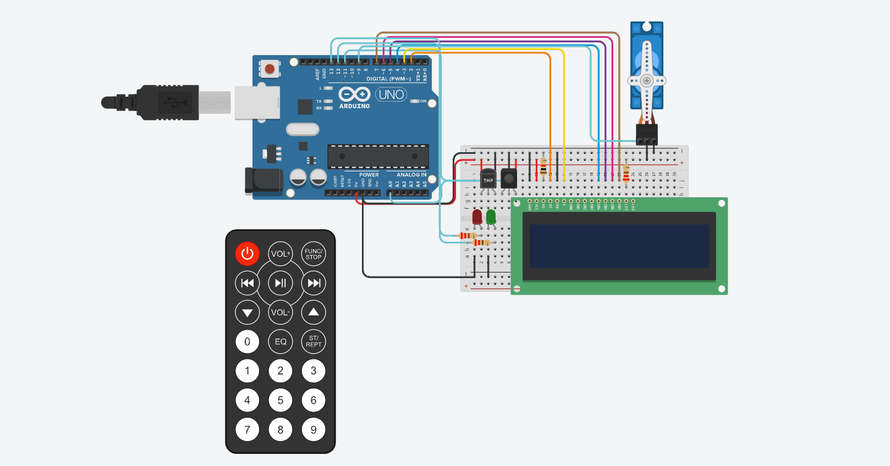

# Documentacion

## Integrantes 
- Tobias Esquivel

## Proyecto: Contador 7segmentos.

## Descripción
Este proyecto consta de una placa de arduino en la cual se simula un sistema de deteccion de incendios

## Función principal
Esta funcion se encarga de la muestra de la temperatura actual y de la estacion del momento en un lcd, en caso
de que haya un incendio al superarse los 60°C se informara por el mismo.

~~~ C (lenguaje en el que esta escrito)
void mostrarTemperatura(LiquidCrystal lcd, float temperatura, char inicialEstacion,bool hayIncendio){
  char estaciones[] = {'v','o','i','p'};
  lcd.clear();
  if (!hayIncendio){
    

    lcd.setCursor(0,0);
    lcd.print(temperatura);
    lcd.print("*C");
    lcd.setCursor(0,1);
    switch(inicialEstacion)
    {
      case 'v':
          lcd.print("Verano");
          break;
      case 'o':
          lcd.print("Otonio");
          break;
      case 'i':
          lcd.print("Invierno");
          break;
      case 'p':
          lcd.print("Primavera");
          break;
    }
  }
  else{
    lcd.print("Incendio");
  }
}
~~~

## Componentes

Sensor temperatura:
  Es el encargado de medir la temperatura ambiental.

IR sensor:
  Es el encargado de recibir las señales proporcionadas por el control remoto.

LCD 16x2:
  Es el encargado de mostrar la temperatura y estacion actual y en caso de haber un incendio, informarlo.

Microservo:
  Es el encargado de simular un sistema de apagado de incendios al momento de haber uno.

Leds:
  Rojo:
    Es el encargado de informar si el sistema esta apagado.
  Verde:
    Es el encargado de informar si el sistema esta encendido.

## Link al proyecto
- [proyecto](https://www.tinkercad.com/things/ep4ZXm84eWU-sizzling-hango-lahdi/editel?sharecode=vTvOF3JB_DkQ4YNzWXo3FMdDmOcZ8ZwrP1XTDmGP4TE)

## Esquema del proyecto
- [esquema](./Esquema/esquema.png)

